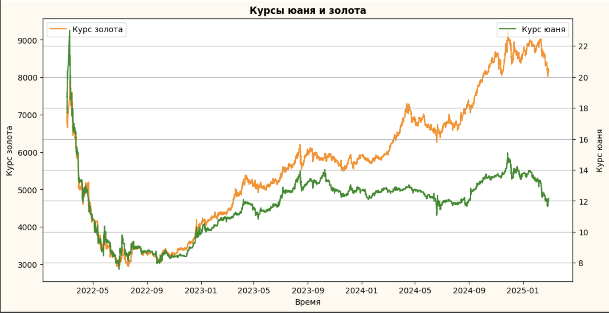
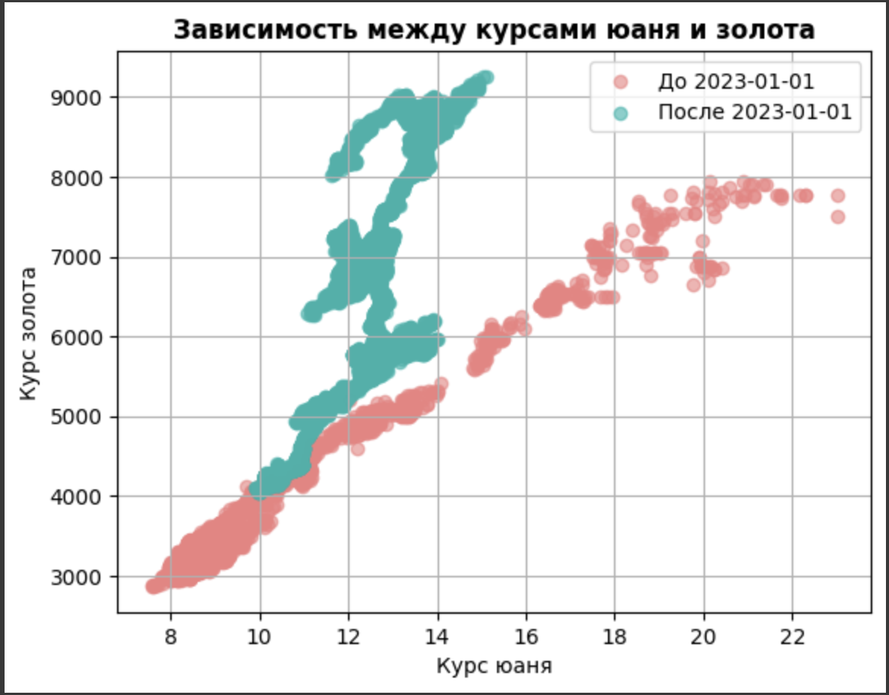
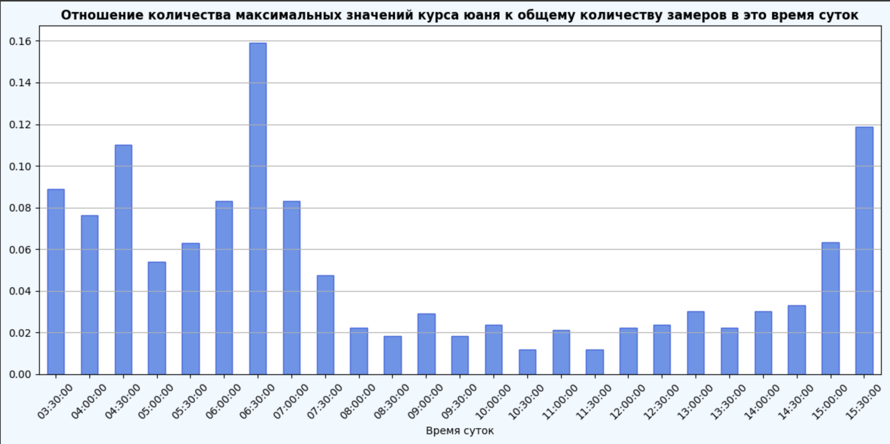
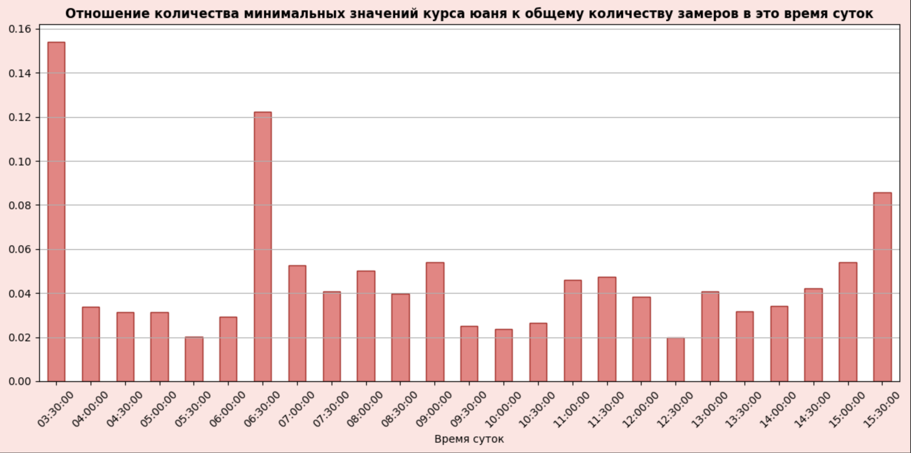
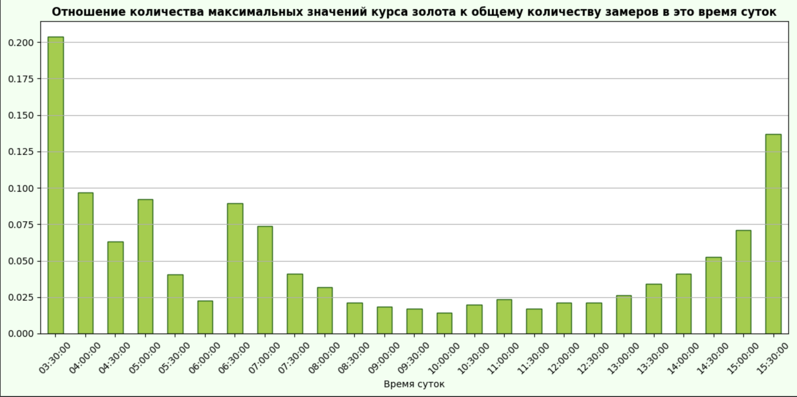
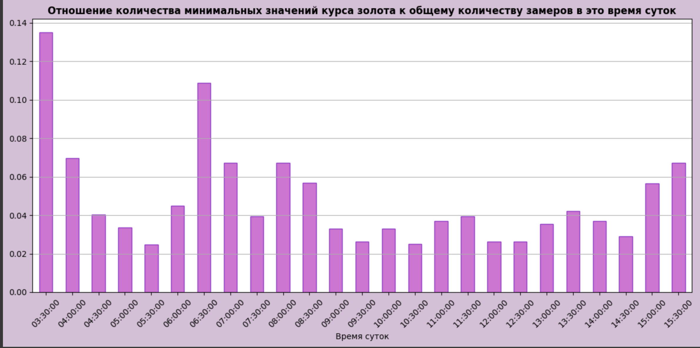
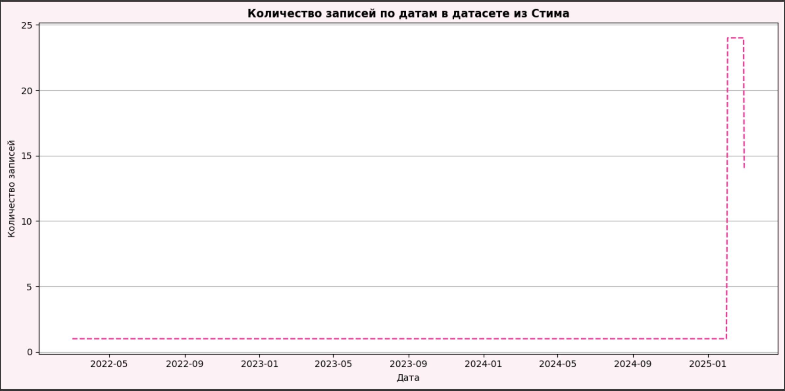
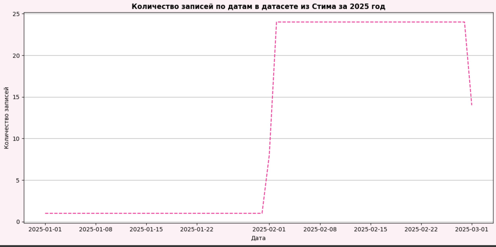
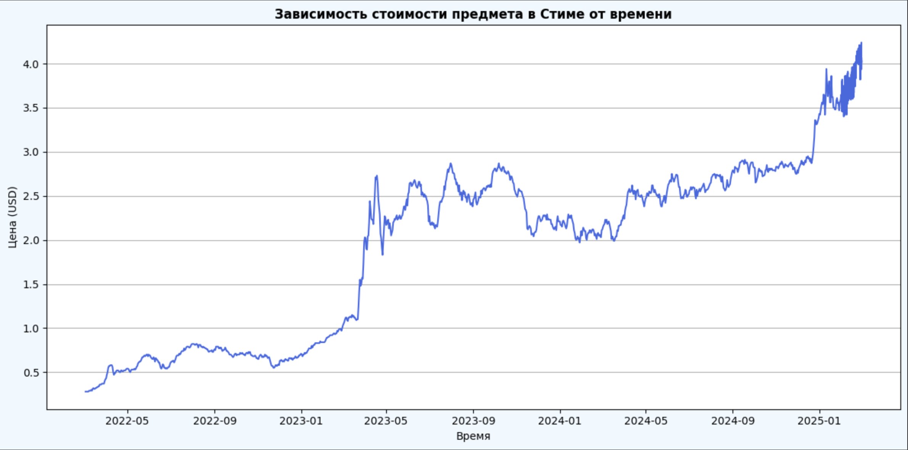

# GP_2_SMADIMO

## Steam Market Parser

Продвинутый инструмент для анализа исторических данных о ценах на предметы с торговой площадки Steam. Этот парсер использует Selenium для извлечения ценовых данных, анализа временных рядов и создания визуализаций.

**Пример графика цен**

## 🔥 Ключевые возможности

- **Автоматический сбор данных** с торговой площадки Steam через Selenium  
- **Анализ цен** за последние 3 года с максимально доступной частотой  
- **Расчёт временных интервалов** между точками данных (мин/макс/средний)  
- **Подробная статистика** о собранных данных  
- **Визуализация истории цен** с помощью графиков  
- **Экспорт данных** в различные форматы CSV  
- **Детальное логирование** всех этапов работы через loguru  
- **Сбор данных по RUB/CNY и gold_price_tom из Tinkoff Investments** для расширенного сравнительного анализа  
- **Сравнение полученных данных** с уровнем инфляции для более глубоких инсайтов  

## 🛠️ Технологии

- **Python 3.8+** – современный, читаемый и поддерживаемый язык программирования  
- **Selenium** – мощный инструмент для автоматизации веб-браузера  
- **Matplotlib** – библиотека для создания качественных визуализаций  
- **Pandas** – для обработки и анализа данных  
- **Loguru** – продвинутая система логирования для отслеживания всех процессов  

## 📊 Результаты анализа

Парсер предоставляет следующую информацию:
- Полная история цен за указанный период  
- Временные промежутки между точками данных (мин/макс/средний)  
- Автоматическая визуализация трендов цен на графике  
- Структурированные данные в формате CSV  

## 🏗️ Структура проекта

TO BE DONE

## 📝 Особенности реализации

- **Надёжность**: парсер имеет несколько запасных вариантов извлечения данных  
- **Гибкость**: работает с различными типами предметов на торговой площадке  
- **Информативность**: подробные логи и статистика для каждого этапа  
- **Отказоустойчивость**: корректная обработка ошибок и исключений  

---

# EDA (Exploratory Data Analysis)

Ниже представлен пример анализа данных о курсах юаня, золота и ценах на предмет из Стима. На графиках **1–10** показаны различные визуализации, полученные в процессе исследования.

### Анализ зависимости между курсами юаня и золота

На первом шаге рассматривалась зависимость между курсами юаня и золота.  

  

На графике 1 можно наблюдать две линейные тенденции. Чтобы разобраться в причинах, построили временной ряд для юаня и золота.

---

### Динамика курсов юаня и золота

  

На графике 2 видно, что до начала 2023 года золото и юань имеют более выраженную корреляцию, после чего зависимости слегка ослабевают. Чтобы подтвердить гипотезу о различных временных периодах, разделили выборку на «до 2023 года» и «после 2023 года»:

  

График 3 подтверждает, что данные действительно формируют две разные линейные тенденции, соответствующие разным отрезкам времени.

---

### Максимальные и минимальные значения курса юаня в течение суток

В рамках дальнейшего анализа рассматривалось, в какое время суток чаще всего юань достигает максимальных и минимальных значений за день.  

  

График 4 показывает отношение количества максимальных значений курса юаня к общему числу измерений в соответствующее время суток. Чаще всего юань достигает максимума около 6:30.  

  

График 5 аналогичен предыдущему, но показывает минимальные значения. Минимум юань чаще всего достигает около 3:30.

---

### Максимальные и минимальные значения курса золота в течение суток

Затем аналогичные исследования были проведены для курса золота. Перед этим были устранены пропуски в данных о золоте.  

  

График 6 показывает, в какое время суток золото чаще всего достигает максимума.  

  

График 7 показывает, в какое время суток золото чаще всего достигает минимума. По данным видно, что золото, как и юань, склонно к экстремальным значениям в районе 3:30 (минимум) и 3:30-6:30 (максимум).

---

## Анализ цен из Стима

Далее рассматривался датасет с историческими данными о цене предмета из Стима, выгружаемый в формате CSV. В нём содержатся столбцы с ценой в долларах и временной меткой в формате UNIX. После конвертации метки во временной формат получены дата и время каждой записи.

Чтобы оценить динамику записей по дням, построили график количества записей в датасете:

  

На графике 8 видно изменение количества записей по датам. При фильтрации на 2025 год:

  

График 9 показывает, сколько записей делалось в каждую дату в 2025 году. С февраля 2025 года данные начали собирать чаще – примерно раз в час.

Динамика цен предмета из Стима за весь период:

  

На графике 10 представлена зависимость стоимости предмета в долларах от времени. Видно, что график отражает различные периоды активности и волатильности.

---

## Объединение данных

После анализа отдельных датасетов объединили их по дате и времени (через `outer join`). В результате получились пропуски (связанные с разной частотой сбора данных), однако для задач EDA это не критично.  

Для удобства был сформирован агрегированный датасет со средними значениями по каждому дню. Далее выяснилось, что из-за выходных и различной периодичности сборов данные о золотe и юане в эти дни отсутствуют. Оставшиеся пропуски было решено не заполнять, так как это не мешало текущему исследованию.

Также была построена тепловая карта корреляций, показавшая, что:
- Курс золота и цена предмета в Стиме коррелируют довольно сильно  
- Курс золота и курс юаня также демонстрируют высокую связь  

---

# Выводы и дальнейшее развитие

1. **Зависимость курсов золота и юаня** меняется во времени (особенно после начала 2023 года).  
2. **Временные паттерны** для максимума и минимума курса в течение суток могут помочь при принятии решений о покупке/продаже.  
3. **Цена предмета в Стиме** потенциально связана с курсом золота, что может служить дополнительным источником прогнозирования.  

В дальнейшем планируется:
- **Добавить возможность** анализа нескольких предметов за один запуск  
- **Интегрировать** парсер с API Tinkoff Investments для более стабильного получения данных  
- **Развивать прогнозные модели** на основе собранных и агрегированных данных  
- **Создать веб-интерфейс**, упрощающий взаимодействие с системой  

Таким образом, парсер обеспечивает сбор и анализ цен с торговой площадки Steam, а также сравнение полученных данных с курсами юаня, золота и уровнем инфляции. Это делает его универсальным инструментом для комплексного исследования динамики цен и разработки прогнозов.
