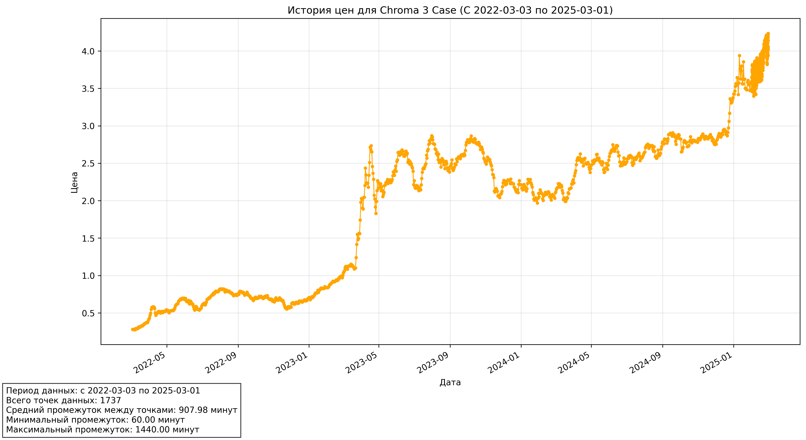

# GP_2_SMADIMO
# Steam Market Parser

Продвинутый инструмент для анализа исторических данных о ценах на предметы с торговой площадки Steam. Этот парсер использует Selenium для извлечения ценовых данных, анализа временных рядов и создания визуализаций.



## 🔥 Ключевые возможности

- **Автоматический сбор данных** с торговой площадки Steam через Selenium
- **Анализ цен за последние 3 года** с максимально доступной частотой
- **Расчёт временных интервалов** между точками данных
- **Подробная статистика** о собранных данных
- **Визуализация** истории цен с помощью графиков
- **Экспорт данных** в различные форматы CSV
- **Детальное логирование** всех этапов работы через loguru

## 🛠️ Технологии

- **Python 3.8+** - современный, читаемый, поддерживаемый язык программирования
- **Selenium** - мощный инструмент для автоматизации веб-браузера
- **Matplotlib** - библиотека для создания качественных визуализаций
- **Pandas** - для обработки и анализа данных
- **Loguru** - продвинутая система логирования для отслеживания всех процессов

## 📋 Требования

Для работы парсера необходимы следующие библиотеки:

```bash
pip install selenium webdriver-manager loguru pandas matplotlib python-dateutil
```

Также требуется установленный Chrome или Firefox.

## 📊 Результаты анализа

Парсер предоставляет следующую информацию:

- **Полная история цен** за указанный период
- **Временные промежутки** между точками данных (мин/макс/средний)
- **Автоматическая визуализация** трендов цен на графике
- **Структурированные данные** в CSV форматах

## 🏗️ Структура проекта

```
TO BE DONE
```

## 📝 Особенности реализации

- **Надежность**: парсер имеет множество запасных вариантов для извлечения данных
- **Гибкость**: работает с различными типами предметов на торговой площадке
- **Информативность**: подробные логи и статистика для каждого этапа
- **Отказоустойчивость**: корректная обработка ошибок и исключений

## 🔄 Дальнейшее развитие

- Добавление возможности анализа нескольких предметов за один запуск
- Интеграция с API для более стабильного получения данных
- Построение прогнозных моделей цен на основе собранных данных
- Создание веб-интерфейса для более удобного использования
